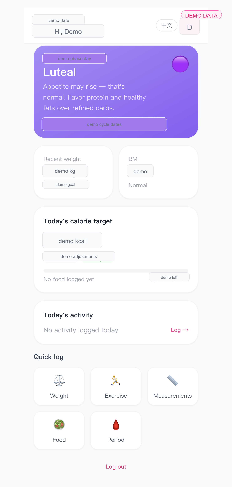
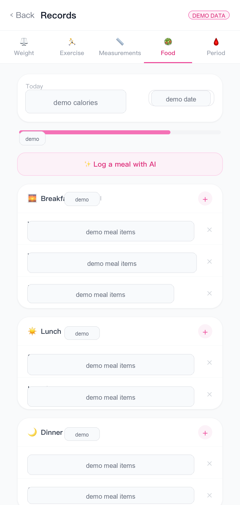
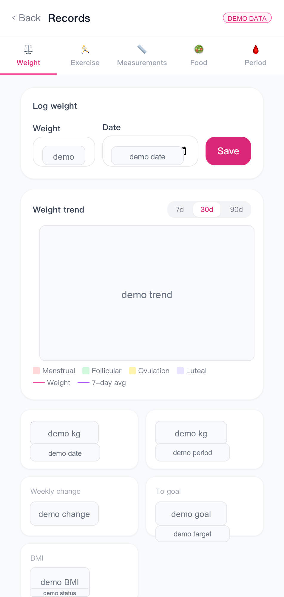
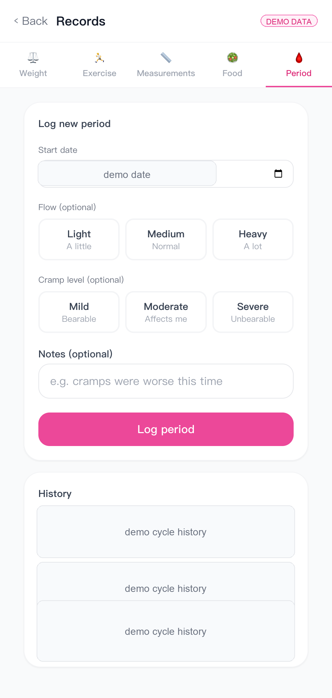
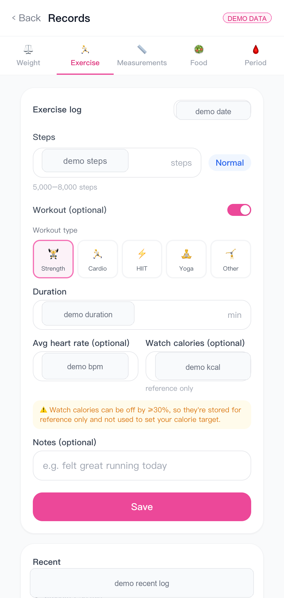
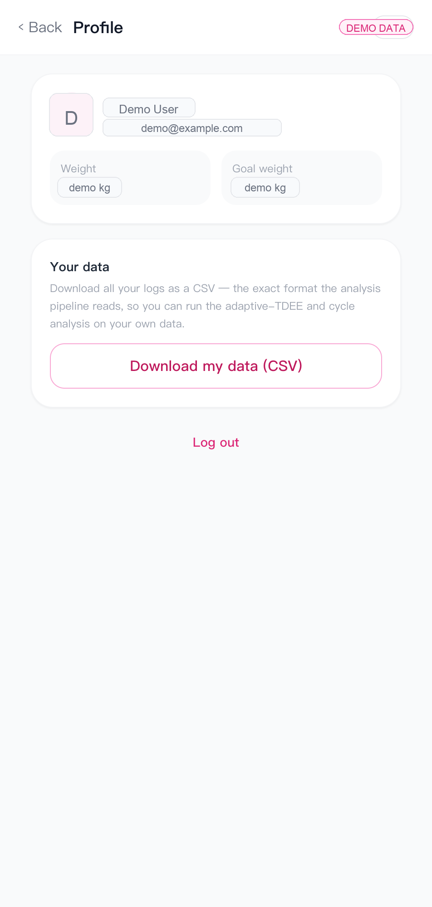
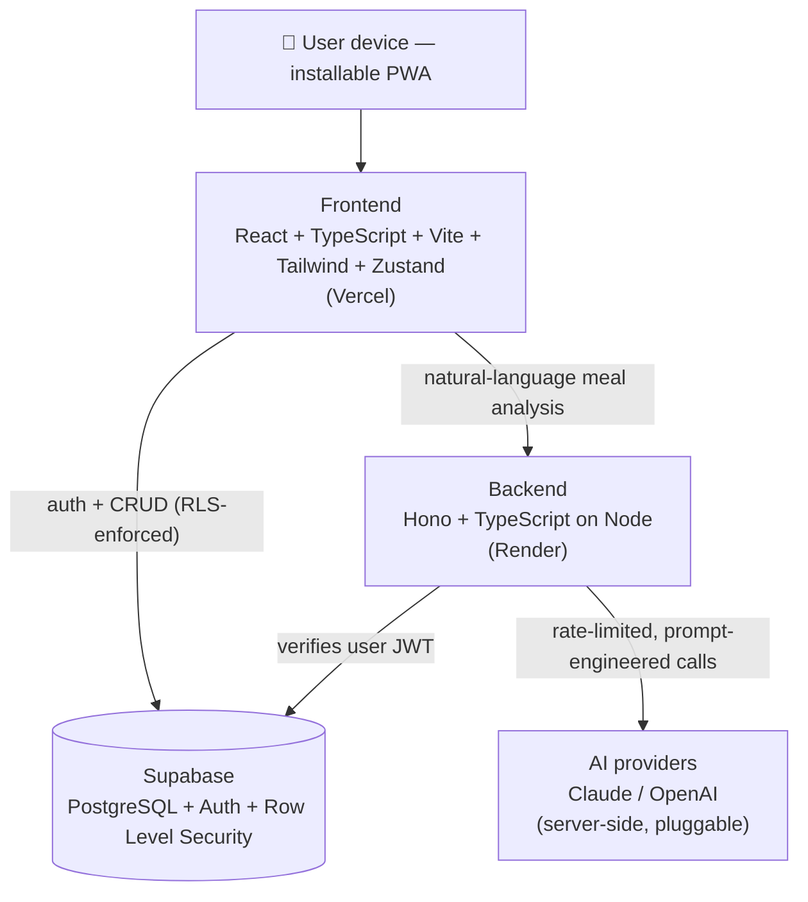

<div align="center">

# 🌸 FemFit

[](https://github.com/miaon1789/femfit/actions/workflows/ci.yml)

**A menstrual-cycle-aware health & nutrition tracker for women**

Most diet and fitness apps are built on research conducted on men. FemFit treats the
menstrual cycle as a first-class variable, dynamically adapting calorie targets and
training guidance to the user's current hormonal phase.

**[🚀 Live Demo](https://femfit-woad.vercel.app)** · [Screenshots](#screenshots) · [Architecture](#architecture) · [Engineering Highlights](#engineering-highlights) · [Data Science](#data-science) · [Roadmap](#roadmap)

</div>

---

> **Status:** Live and feature-complete for the core product. Cycle engine, adaptive
> calorie engine, food logging with a 146-item bilingual database, AI meal analysis, and
> a full English/中文 UI are all shipped end-to-end. A Python data-science layer estimates
> each user's true maintenance calories from their own logs and **feeds the result back
> into the in-app calorie target** (see [Data Science](#data-science)).

## Why FemFit

Conventional weight-loss advice frequently backfires for women because it ignores
hormonal context:

- **Fasted training** can keep cortisol elevated and disrupt the cycle in women.
- **Large sustained calorie deficits** trigger metabolic adaptation more readily.
- **The luteal phase** lowers insulin sensitivity and causes water retention — scale
  weight goes up without real fat gain, which drives anxiety and crash dieting.

FemFit's thesis: **make the cycle the central variable** and let the plan follow the
body's rhythm instead of fighting it.

## Features

| Area | What it does |
| --- | --- |
| **Cycle engine** | Computes the current phase (menstrual / follicular / ovulation / luteal) from the user's *personal* cycle data — not a fixed 28-day assumption — and predicts the next period & ovulation. |
| **Adaptive calorie target** | A four-layer model (base deficit → NEAT/step adjustment → workout adjustment → cycle adjustment) with an individualized minimum-calorie safety floor. |
| **Weight tracking** | Daily logging, 7-day moving average, trend charts with **menstrual-phase background overlays** so users can see that luteal-phase "gain" is water, not fat. |
| **Body measurements** | Chest / waist / navel / hip / thigh tracking with waist–hip ratio. |
| **Exercise logging** | Manual steps (auto-tiered) + workout type/duration, designed to later sync from Health Connect / Apple Health. |
| **Food logging** | Per-meal entries with calorie/macro totals against the adaptive daily target, backed by a **146-item bilingual food database** (Chinese / Western / Asian) with instant search and per-serving scaling. |
| **AI meal analysis** | Natural-language meal parsing ("a bowl of beef noodles with an egg") into foods + calories + macros, with cycle-aware tips — wired end-to-end into the food UI and **localized to the user's language**. |
| **Bilingual (i18n)** | Full English / 中文 interface via `react-i18next` (default English), including locale-aware AI responses and food names. |
| **PWA** | Installable, offline-capable, mobile-first. |

## Screenshots

> Screenshots use anonymized demo entries. Any visible account details, dates, and
> health values are fictitious placeholders for product demonstration only.

<p align="center">
  
  
  
</p>
<p align="center">
  
  
  
</p>

## Architecture



**Design notes**

- The frontend talks **directly to Supabase** for CRUD; row-level security enforces
  per-user data isolation at the database layer.
- The backend exists for work that must stay server-side: **AI calls** (API keys never
  reach the client) and privileged operations. It verifies the Supabase JWT on every
  request and applies per-user daily rate limits.
- AI providers sit behind a **single interface** switchable via `AI_PROVIDER`, so
  Claude / OpenAI / DeepSeek are swappable without touching call sites.

## Engineering Highlights

These are the parts worth reading — they go beyond CRUD.

- **`frontend/src/lib/cycleEngine.ts`** — phase calculation from individual cycle
  history with next-period / ovulation prediction.
- **`frontend/src/lib/calorieEngine.ts`** — the four-layer adaptive target:
  Mifflin-St Jeor BMR → activity-factor TDEE → pace-based deficit (clamped) → NEAT step
  delta vs. the user's own 14-day baseline → conservative workout top-up → gentle cycle
  adjustment, all floored at `max(1200, 0.9 × BMR)` to avoid unsafe targets. It also
  **auto-detects activity level** from the last 14 days of real step/workout data instead
  of asking the user to self-select.
- **`backend/src/routes/ai.ts`** — provider-agnostic AI layer, structured-JSON prompt,
  per-user daily quota, results persisted for reuse.
- **Security** — Postgres Row Level Security, server-only service-role key, JWT
  verification middleware, secrets isolated to environment variables.

## Data Science

> 📓 **[Full write-up & executed notebook → `analysis/`](analysis/README.md)**

FemFit's longitudinal logs (weight, intake, steps, cycle phase) power a Python analysis
layer that goes beyond textbook formulas — and **closes the loop back into the product**:

- **Adaptive TDEE** — textbook maintenance calories (Mifflin-St Jeor × activity factor)
  can be hundreds of kcal off for an individual. We estimate the *personal* maintenance
  level directly from energy balance — `TDEE = mean_intake − weight_slope × 7700` — via
  OLS on the user's own weight trend, with a 95% CI and an expanding-window view of how
  the estimate converges. This estimate is **surfaced back into the app's calorie engine**
  (`useMaintenanceTDEE` → `dataTDEE`), so the in-app target shifts from a population prior
  to the user's measured reality once enough history exists.
- **Cycle-vs-weight effect** — we test FemFit's core claim (luteal "weight gain" is water,
  not fat) by detrending weight and comparing phases with one-way ANOVA + a luteal-vs-
  follicular t-test and Cohen's d.
- **Validated against ground truth** — methods are checked on synthetic data with *known*
  injected parameters (true TDEE, true luteal water peak) and recover them within CI — a
  stronger correctness argument than eyeballing one real series, and the same `load_data`
  loader swaps in real CSV exports from the app when history allows.

## Tech Stack

| Layer | Tech |
| --- | --- |
| Frontend | React 18, TypeScript, Vite, Tailwind CSS, Zustand, React Router, Recharts, vite-plugin-pwa |
| Backend | Node.js, Hono, TypeScript, Zod |
| Database / Auth | Supabase (PostgreSQL, Auth, Row Level Security) |
| AI | Claude / OpenAI (pluggable, server-side) |
| i18n | react-i18next (English / 中文) |
| Data Science | Python, pandas, NumPy, statsmodels, SciPy, scikit-learn, Jupyter |
| Hosting | Vercel (frontend) · Render (backend) |

## Getting Started

**Prerequisites:** Node.js 20+, a free [Supabase](https://supabase.com) project.

```bash
# 1. Install dependencies for both packages
npm run install:all

# 2. Configure environment
cp frontend/.env.example frontend/.env   # add your Supabase URL + anon key
cp backend/.env.example  backend/.env    # add Supabase keys + an AI API key

# 3. Apply the database schema in the Supabase SQL editor
#    supabase/schema.sql  then  supabase/migrations/*.sql

# 4. Run frontend + backend together
npm run dev
# frontend → http://localhost:5173   backend → http://localhost:3000
```

**Tests** — the cycle & calorie engines are covered by Vitest unit tests, run in CI on
every push/PR:

```bash
cd frontend && npm test        # Unit and hook regression tests
```

Browser tests cover login/logout, food persistence, deletion and failed-save recovery using a separate Supabase test project. Real E2E execution requires the test project credentials and is not implied by the unit CI result.

## Roadmap

**Recently shipped**

- [x] Data-science layer (Python): energy-balance adaptive TDEE + cycle-vs-weight testing, as a reproducible notebook.
- [x] Surface the estimated TDEE back into the app's calorie engine (closed loop).
- [x] AI meal-analysis API wired end-to-end into the food-logging UI.
- [x] 146-item bilingual food database with in-app search.
- [x] Full English / 中文 internationalization.
- [x] Live deployment (Vercel + Render + Supabase).
- [x] Unit tests (Vitest) for the cycle & calorie engines + GitHub Actions CI.

**Next**

- [ ] Plateau (change-point) detection on the weight trend.
- [ ] Android packaging via Capacitor with Health Connect step sync.
- [ ] Analysis screen: weekly AI report and cycle-correlation insights.

## Disclaimer

FemFit provides general nutrition and exercise information for educational purposes only.
It is not medical advice. Cycle-phase guidance is based on user-recorded data and general
physiological models; individual results vary. Anyone with a relevant medical condition
(e.g. PCOS, thyroid disorders, eating disorders) should consult a qualified professional.

---

<div align="center">
<sub>Built as a full-stack + data-science portfolio project.</sub>
</div>
